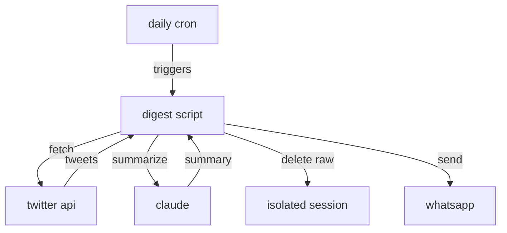

# clawd digest

privacy-conscious twitter feed summarizer → daily whatsapp summaries

## setup

### 1. get twitter api credentials
- go to https://developer.twitter.com/
- create app, generate: api key, api secret, bearer token, access token, access token secret

### 2. deploy clawdbot to cloud
- railway.app or render.com
- deploy using docker

### 3. install python dependencies
```bash
pip install -r requirements.txt
```

### 4. environment variables
```
TWITTER_API_KEY=your_api_key
TWITTER_API_SECRET=your_api_secret
TWITTER_BEARER_TOKEN=your_bearer_token
TWITTER_ACCESS_TOKEN=your_access_token
TWITTER_ACCESS_TOKEN_SECRET=your_access_token_secret
ANTHROPIC_API_KEY=your_anthropic_key
OPENCLAW_GATEWAY_TOKEN=generate_secure_token
```

### 5. pair whatsapp
```bash
openclaw channels login
```

### 6. create cron job
```bash
openclaw cron add \
  --name "twitter digest" \
  --cron "0 8 * * *" \
  --tz "America/Los_Angeles" \
  --session isolated \
  --message "run python twitter-digest.py and summarize the output" \
  --deliver \
  --channel whatsapp \
  --to "+YOUR_PHONE"
```

## how it works



uses your personalized twitter home timeline - same tweets you see when you open twitter

## privacy
- isolated sessions, no persistent storage
- raw tweets deleted immediately after processing
- only summary is stored/delivered
- credentials secured as env vars
